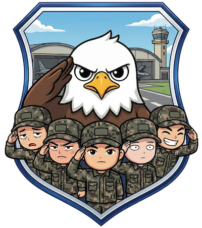

<p align="center">
    
</p>
<p align="center">
    
</p>
<p align="center">
<em>"준비 된 인원부터 각 분대로 헤쳐모여!"</em>
</p>
<p align="center">

<a href="https://bnbong.itch.io/" target="_blank">
    
</a>
<a href="https://github.com/bnbong/Fall-In/releases" target="_blank">
    
</a>
</p>

---

대한민국 공군 ORI 훈련을 배경으로 한 전략 카드 게임.  
보드게임 '[젝스님트(6 Nimmt!)](https://boardgamegeek.com/boardgame/432/take-5)'를 기반으로 제작되었습니다.

## 게임 소개

**ORI 훈련 당일, 비행단장 눈에 띄지 않게 위험한 병사들을 분대에 적절히 배치하라!**

4명의 플레이어가 동시에 카드를 선택하여 4열 게임판에 배치합니다.  
위험도가 66점이 넘으면 탈락! 마지막까지 생존하면 승리합니다.

### 게임 스토리

> 어느 평화롭던(?) 대한민국 공군 ○○비행단 군사경찰대대.
> 
> 
> ORI(전투지휘검열 훈련, 공군에서 실시하는 대규모 훈련 중 하나)를 앞두어 갑작스럽게 공군본부에서 3군 훈련 체계 통일화 및 기지 작전 능력 향상 명령이 내려와
> 
> 훈련 개시 당일, 훈련에 참가하는 각 대대 인원을 분대로 세분화 하라는 지시를 받았다. 이때 부대원 편성은 비행단 전 대대 작전 계열이 연합해서 수행하라는 말도 안되는 지시가 같이 내려왔다.
> 
> 빠른 작전 수행을 위함이니, 효율을 위함이니를 운운하며 뒷목을 절로 잡게 만드는 상급 부대의 명령 이행은 이번에도 역시나 작전계 말단 간부인 **당신**의 몫이 되었다.
> 
> 병사들은 대개 착하고 좋은 애들만 있지만 일부 병사들은 '위험도'가 높다. 
> 
> 불만이 많거나, 실수가 잦거나,
> 
> 혹은 ***무슨 속내를 가지고 있는지 알 수 없어*** 건들기 어려운 병사들이다.
> 
> 플레이어는 대대 인원을 적절하게 차출하여 분대를 잘 꾸려야 한다.
> 
> 위험도가 높은 병사들이 너무 많이 모여 비행단장의 눈에 띄지 않도록 적절히 배치하라.
> 
> 만약 배치한 분대가 너무 삐리해지거나 [다른 쪽으로 위험](https://namu.wiki/w/%EC%BF%A0%EB%8D%B0%ED%83%80)해지면... 당신의 남은 군생활이 어두워진다.
>

## 개발 환경

- **Python**: 3.12+
- **Game Engine**: Pygame-CE
- **Package Manager**: uv

## 설치 및 실행

### 의존성 설치

```bash
uv sync
```

### 게임 실행

```bash
uv run fall-in
```

또는

```bash
uv run python -m fall_in.main
```

## 프로젝트 구조

```
fall_in/
├── src/fall_in/          # 게임 소스 코드
│   ├── config.py         # 게임 설정
│   ├── main.py           # 게임 진입점
│   ├── core/             # 핵심 게임 로직
│   ├── scenes/           # 게임 씬 (Title, Game, Result 등)
│   ├── ui/               # UI 컴포넌트
│   ├── ai/               # AI 플레이어 로직
│   ├── data/             # 게임 데이터 로더 로직
│   ├── entities/         # 게임 엔티티
│   └── utils/            # 유틸리티 함수
├── assets/               # 게임 리소스 (이미지, 사운드, 폰트)
├── data/                 # 게임 데이터 (병사, 대사)
└── tests/                # 테스트 코드
```

## 게임 규칙

1. 각 플레이어는 10장의 카드(병사)를 받습니다
2. 모든 플레이어가 동시에 1장씩 카드를 선택합니다
3. 카드를 숫자 순서대로 4열 중 하나에 배치합니다
4. 6번째 카드 배치 시, 해당 열의 위험도를 벌점으로 획득합니다
5. 벌점으로 얻은 병사들의 위험도 합산이 66점 이상이면 탈락!
